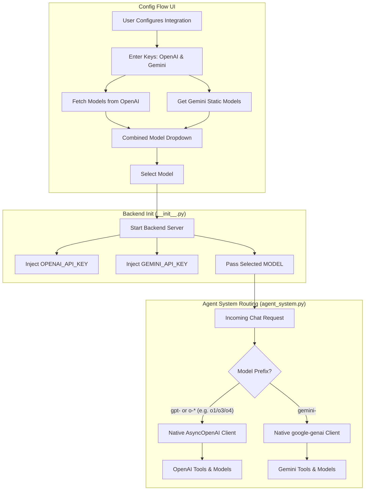

# Dual-Provider Native Integration Plan

This plan updates the Home Assistant AI Config Agent to support **simultaneous dual-provider configuration**. Instead of forcing the user to pick a single provider during setup, the user can input both their OpenAI API key and their Gemini API key, see a combined list of models, and use the native SDKs for each.

## User Review Required

> [!IMPORTANT]  
> This changes the configuration user experience. Users will be asked for either/both their OpenAI API key and Gemini API key on the same screen, and the model dropdown will let them seamlessly switch between models from both providers without having to swap API keys. Please review the proposed changes below to ensure this matches your vision.

## Architecture Flowchart

## Proposed Changes

---

### 1. Dependencies

#### [MODIFY] `custom_components/aiassistant/manifest.json`

- Add `google-genai` to `"requirements"`. The OpenAI client is already included.

---

### 2. Configuration & Setup (The UI)

#### [MODIFY] `custom_components/aiassistant/const.py`

- Remove the global `CONF_API_KEY` and specific `CONF_PROVIDER` string mapping.
- Add `CONF_OPENAI_API_KEY` and `CONF_GEMINI_API_KEY`.
- Combine the standard default models for OpenAI and Gemini into a unified list.

#### [MODIFY] `custom_components/aiassistant/config_flow.py`

- **Initial Setup Step (`async_step_user`)**: Display a form asking for both `CONF_OPENAI_API_KEY` (optional) and `CONF_GEMINI_API_KEY` (optional). At least one must be provided.
- **Model Selection Step (`async_step_configure`)**: Fetch available models from OpenAI (if the OpenAI key is provided) and append the statically defined Gemini models (if the Gemini key is provided). Display them in a single unified dropdown.
- **Options Flow**: Allow users to update either API key and dynamically change the model at any time from the integration settings block.

#### [MODIFY] `custom_components/aiassistant/__init__.py`

- Update `_start_server` to inject both `OPENAI_API_KEY` and `GEMINI_API_KEY` into the backend server's environment block.
- Pass the selected model (`CONF_MODEL`) explicitly so the server knows which one is active.

---

### 3. Backend Agent Routing

#### [MODIFY] `custom_components/aiassistant/src/agents/agent_system.py`

- Initialize **both** the `AsyncOpenAI` client (if `OPENAI_API_KEY` exists) and the `genai.Client` (if `GEMINI_API_KEY` exists).
- In the `chat_stream` function, check the currently set `model` name.
  - If the model string starts with `gpt-` or `o1-`, `o3-`, `o4-`, route the request natively through the OpenAI client stream.
  - If the model string starts with `gemini-`, route the request natively through the `google-genai` client stream with its specific tool schemas.

## Open Questions

> [!WARNING]
>
> 1. Should we drop the other providers (Anthropic, Ollama, OpenRouter) out of the UI, or just make OpenAI and Gemini the natively-supported "first class" options on the main screen?
> 2. Will the user ever need to talk to *both* an OpenAI model and a Gemini model in the exact same chat session, or is the model always selected globally in the integration options before chatting?

## Verification Plan

### Automated Tests

- Validate all backend formatting and syntax.

### Manual Verification

- Install the updated addon.
- Verify the config flow prompts for both keys instead of asking for a provider choice.
- Verify that entering an OpenAI key and a Gemini key successfully yields a model dropdown containing both `gpt-4o` and `gemini-2.5-flash`.
- Route a system command (like reading `configuration.yaml`) through both models interchangeably using the Options flow to switch the model.
